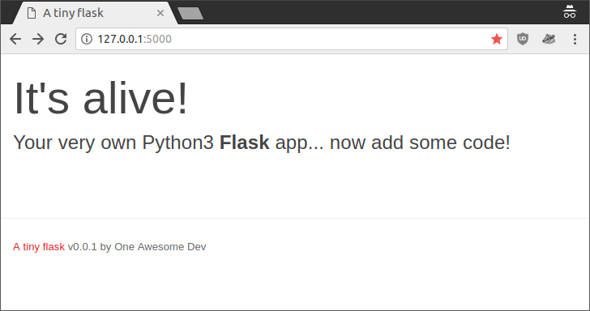

# A tiny flask web app blueprint

This a basic `python3` [flask webapp](http://flask.pocoo.org/) blueprint for quickly adding a web interface to your python scripts. What you get:

- A [flask webapp](http://flask.pocoo.org/) organized as a python package following the [larger applications template](http://flask.pocoo.org/docs/0.12/patterns/packages/#larger-applications).
- A html template starting point using [Bootstrap 3.3.7](https://getbootstrap.com/docs/3.3/) to extend for pretty, modern and responsive webpages!
- `Work-in-progress` A [Dockerfile](Dockerfile) to build your very own container and easily deploy it anywhere.

## Start here

First, clone this repository `git clone https://github.com/cmsirbu/tiny-flask` or [download a zip file](https://github.com/cmsirbu/tiny-flask/archive/master.zip). You don't really need the whole git part as this is the start of an application of your own!

Then, to develop locally, the cleanest way to do it is with a [python virtualenv](https://docs.python.org/3/tutorial/venv.html). Make sure you have `python3` and `pip3` installed, then run the commands below (only once, for setup):

```
# make sure you're in the repository you just downloaded
cd tiny-flask
# create a virtualenv and activate it
pyvenv venv
source venv/bin/activate
# update the tools
pip install -U pip setuptools
# install the tiny-flask package in the venv with its dependencies
pip install -e .
```

Once you have that set up, you can start the application in development mode anytime using:

```
# activate the virtualenv (only if it's not already)
source venv/bin/activate
# start flask's development webserver
FLASK_APP=tinyflask flask run
```

You should see a message like this:

```
 * Serving Flask app "tinyflask"
 * Running on http://127.0.0.1:5000/ (Press CTRL+C to quit)
```

Now open `http://127.0.0.1:5000/` in your browser:



Success!
